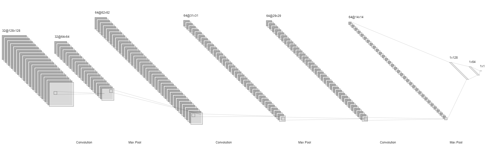
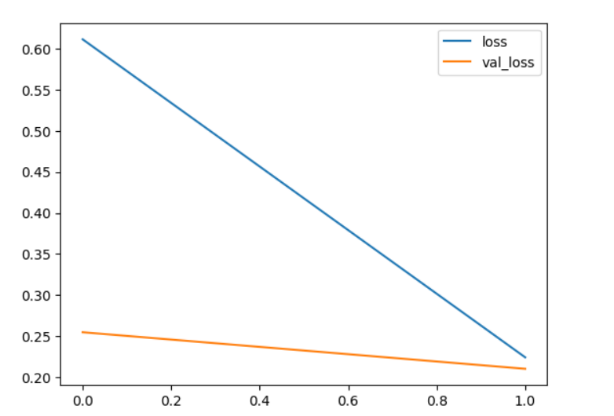
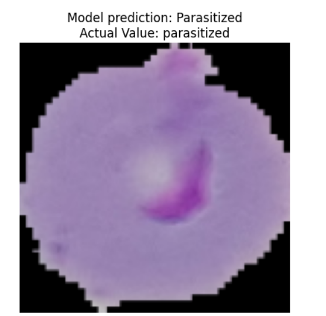
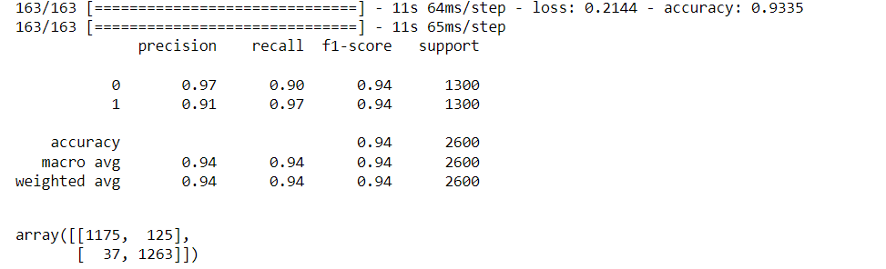

# Deep Neural Network for Malaria Infected Cell Recognition

## AIM

To develop a deep neural network for Malaria infected cell recognition and to analyze the performance.

## Problem Statement and Dataset

The problem at hand is the automatic classification of red blood cell images into two categories: parasitized and uninfected. Malaria-infected red blood cells, known as parasitized cells, contain the Plasmodium parasite, while uninfected cells are healthy and free from the parasite. The goal is to build a convolutional neural network (CNN) model capable of accurately distinguishing between these two classes based on cell images.

Traditional methods of malaria diagnosis involve manual inspection of blood smears by trained professionals, which can be time-consuming and error-prone. Automating this process using deep learning can significantly speed up diagnosis, reduce the workload on healthcare professionals, and improve the accuracy of detection.

Our dataset comprises 27,558 cell images, evenly split between parasitized and uninfected cells. These images have been meticulously collected and annotated by medical experts, making them a reliable source for training and testing our deep neural network.

## Neural Network Model



## DESIGN STEPS

- **Step 1:** We begin by importing the necessary Python libraries, including TensorFlow for deep learning, data preprocessing tools, and visualization libraries.

- **Step 2:** To leverage the power of GPU acceleration, we configure TensorFlow to allow GPU processing, which can significantly speed up model training.

- **Step 3:** We create an image generator that performs data augmentation, including rotation, shifting, rescaling, and flipping. Data augmentation enhances the model's ability to generalize and recognize malaria-infected cells in various orientations and conditions.

- **Step 4:** We design a convolutional neural network (CNN) architecture consisting of convolutional layers, max-pooling layers, and fully connected layers. The model is compiled with appropriate loss and optimization functions.

- **Step 5:** We split the dataset into training and testing sets, and then train the CNN model using the training data. The model learns to differentiate between parasitized and uninfected cells during this phase.

- **Step 6:** We evaluate the trained model's performance using the testing data, generating a classification report and confusion matrix to assess accuracy and potential misclassifications.

## PROGRAM

```
Developed by: SRIJITH R
Register No : 212221240054
```
```python
import os
import pandas as pd
import numpy as np

import seaborn as sns
import matplotlib.pyplot as plt
from matplotlib.image import imread
from tensorflow.keras.preprocessing.image import ImageDataGenerator
from tensorflow import keras
from tensorflow.keras import layers
from tensorflow.keras import utils
from tensorflow.keras import models
from sklearn.metrics import classification_report,confusion_matrix
import tensorflow as tf
# to share the GPU resources for multiple sessions
from tensorflow.compat.v1.keras.backend import set_session
config = tf.compat.v1.ConfigProto()
config.gpu_options.allow_growth = True # dynamically grow the memory used on the GPU
config.log_device_placement = True # to log device placement (on which device the operation ran)
sess = tf.compat.v1.Session(config=config)
set_session(sess)

%matplotlib inline
```
```python
my_data_dir = 'dataset/cell_images'
os.listdir(my_data_dir)
test_path = my_data_dir+'/test/'
train_path = my_data_dir+'/train/'
os.listdir(train_path)
print(len(os.listdir(train_path+'/uninfected/')))
print(len(os.listdir(train_path+'/parasitized/')))
para_img= imread(train_path+
                 '/parasitized/'+
                 os.listdir(train_path+'/parasitized')[0])
```
```python
plt.imshow(para_img)
```
```python
dim1 = []
dim2 = []
for image_filename in os.listdir(test_path+'/uninfected'):
    img = imread(test_path+'/uninfected'+'/'+image_filename)
    d1,d2,colors = img.shape
    dim1.append(d1)
    dim2.append(d2)

print(dim1)
```
```python
sns.jointplot(x=dim1,y=dim2)
```
```python
image_shape = (130,130,3)

image_gen = ImageDataGenerator(rotation_range=20, # rotate the image 20 degrees
                               width_shift_range=0.10, # Shift the pic width by a max of 5%
                               height_shift_range=0.10, # Shift the pic height by a max of 5%
                               rescale=1/255, # Rescale the image by normalzing it.
                               shear_range=0.1, # Shear means cutting away part of the image (max 10%)
                               zoom_range=0.1, # Zoom in by 10% max
                               horizontal_flip=True, # Allo horizontal flipping
                               fill_mode='nearest' # Fill in missing pixels with the nearest filled value
                              )
```
```python
model = models.Sequential()
model.add(keras.Input(shape=(image_shape)))
model.add(layers.Conv2D(filters=32,kernel_size=(3,3),activation='relu',))
model.add(layers.MaxPooling2D(pool_size=(2, 2)))

model.add(layers.Conv2D(filters=64, kernel_size=(3,3), activation='relu',))
model.add(layers.MaxPooling2D(pool_size=(2, 2)))

model.add(layers.Conv2D(filters=64, kernel_size=(3,3), activation='relu',))
model.add(layers.MaxPooling2D(pool_size=(2, 2)))

model.add(layers.Flatten())

model.add(layers.Dense(128))
model.add(layers.Dense(64,activation='relu'))
model.add(layers.Dropout(0.5))
model.add(layers.Dense(1,activation='sigmoid'))
model.compile(loss='binary_crossentropy',optimizer='adam',metrics=['accuracy'])
model.summary()
```
```python
batch_size = 16

train_image_gen = image_gen.flow_from_directory(train_path,
                                               target_size=image_shape[:2],
                                                color_mode='rgb',
                                               batch_size=batch_size,
                                               class_mode='binary')


test_image_gen = image_gen.flow_from_directory(test_path,
                                               target_size=image_shape[:2],
                                               color_mode='rgb',
                                               batch_size=batch_size,
                                               class_mode='binary',shuffle=False)
```
```python

results = model.fit(train_image_gen,epochs=2,validation_data=test_image_gen)
```
```python
losses = pd.DataFrame(model.history.history)

losses[['loss','val_loss']].plot()
```
```python
import random
import tensorflow as tf

list_dir=["UnInfected","parasitized"]
dir_=(list_dir[1])
para_img= imread(train_path+
                 '/'+dir_+'/'+
                 os.listdir(train_path+'/'+dir_)[random.randint(0,100)])
img  = tf.convert_to_tensor(np.asarray(para_img))
img = tf.image.resize(img,(130,130))
img=img.numpy()
pred=bool(model.predict(img.reshape(1,130,130,3))<0.5 )
plt.title("Model prediction: "+("Parasitized" if pred  else "Un Infected")+"\nActual Value: "+str(dir_))
plt.axis("off")
plt.imshow(img)
plt.show()
```
```python

model.evaluate(test_image_gen)
pred_probabilities = model.predict(test_image_gen)
test_image_gen.classes
predictions = pred_probabilities > 0.5
print(classification_report(test_image_gen.classes,predictions))
confusion_matrix(test_image_gen.classes,predictions)

```

## OUTPUT

### Training Loss, Validation Loss Vs Iteration Plot



### Classification Report and Confusion Matrix



### New Sample Data Prediction



## RESULT

Thus a deep neural network for Malaria infected cell recognition and to analyze the performance is created using tensorflow.
